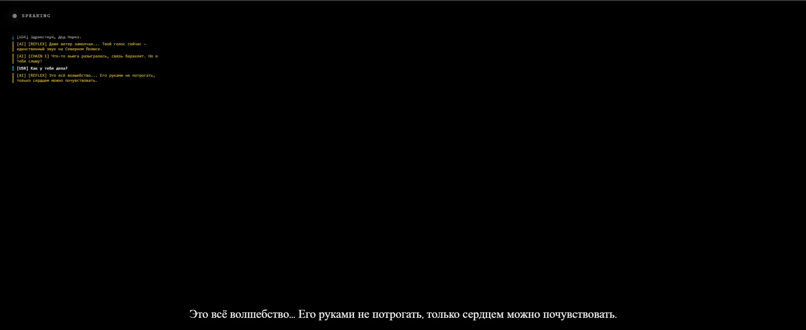
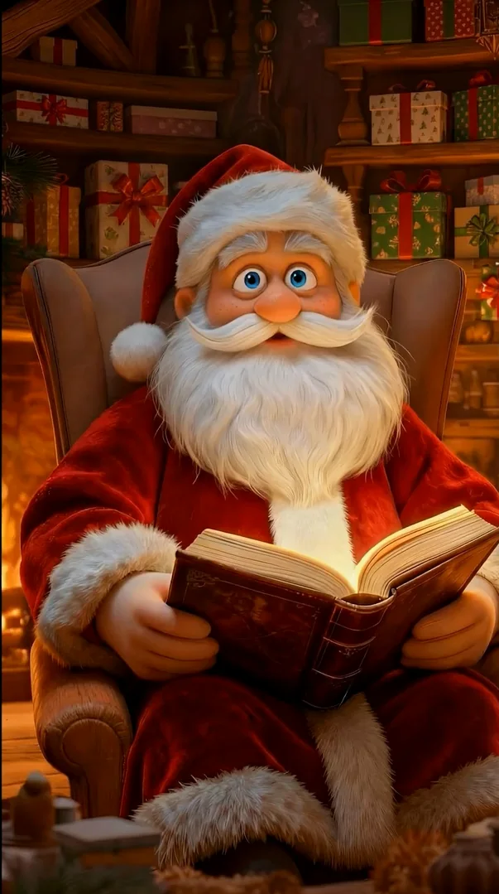

# AI Ded Moroz

Commercial conversational AI prototype with speech recognition, LLM-driven response planning, synthesized voice and semantic video routing.

  

## My role

I worked on the conversational AI and generative-media layer:

- character behaviour and prompt architecture
- speech transcription workflow
- structured response chains
- semantic video routing
- parallel TTS and video preloading
- fallback handling
- generated reaction and scene library

`Microphone -> VAD -> Speech-to-Text -> LLM -> structured response -> video + TTS -> playback`

## Runtime prototype

The interface below was used to validate the conversation pipeline, logs, subtitles and playback flow.

## Generated media

The prototype uses a tagged library of short reactions and longer scenes. The model can return a `video_id` together with text, and the playback layer resolves it to the matching generated clip.

| Story scene | Gift scene |
| --- | --- |
|  |  |

The public video library and the generated assets shown here were created by **Tim Ostvald**.

## Stack

`JavaScript` · `Whisper` · `LLM APIs` · `TTS` · `Web Audio` · `MediaRecorder`

## Repository

- `src/index.html` — public prototype and media demo
- `src/video-library.js` — generated video library and semantic tags
- `docs/ARCHITECTURE.md` — technical flow and latency strategy

Provider credentials and private production integrations are intentionally omitted from the public repository.

---

Built by **Tim Ostvald** and **Zakhar Kondratiev**.
